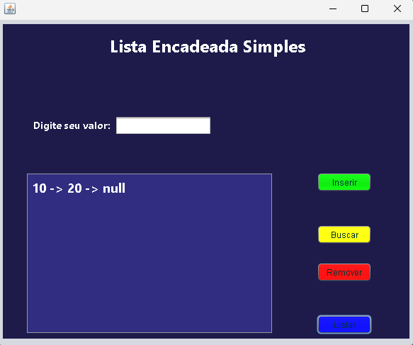
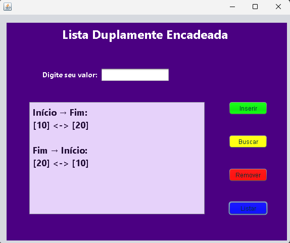
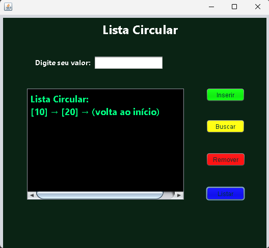

# 🧠 Estruturas de Dados em Java

Projeto desenvolvido em **Java** com o objetivo de implementar e demonstrar o funcionamento de três tipos de **listas encadeadas**:  
**Lista Simples**, **Lista Duplamente Encadeada** e **Lista Circular**.  

Cada estrutura foi desenvolvida separadamente, seguindo os princípios de **modularidade** e **clareza de código**,  
e conta com uma **interface gráfica em Java Swing (JFrame)** para visualização interativa do comportamento das listas.

---

## 🧩 Estruturas Implementadas

### 🔹 Lista Encadeada Simples
A **lista simples** é formada por nós que contêm um valor e uma referência para o próximo nó.  
Cada elemento aponta apenas para o **seu sucessor**, e o último elemento aponta para **null**.

**Operações implementadas:**
- Inserir elemento no final da lista  
- Buscar elemento pelo valor  
- Remover elemento pelo valor  
- Listar todos os elementos  

📘 **Exemplo visual:**  
`10 → 20 → 30 → null`

---

### 🔸 Lista Duplamente Encadeada
A **lista duplamente encadeada** contém referências tanto para o **próximo** quanto para o **anterior**.  
Isso permite percorrer a lista em ambas as direções.

**Operações implementadas:**
- Inserir elemento no final  
- Remover elemento por valor  
- Buscar elemento  
- Listar do início ao fim  
- Listar do fim ao início  

📘 **Exemplo visual:**  
`null ← 10 ⇄ 20 ⇄ 30 → null`

---

### 🔁 Lista Circular
Na **lista circular**, o último nó aponta de volta para o primeiro, formando um ciclo contínuo.  
Ela é muito utilizada em sistemas que precisam de **rotatividade** (como playlists ou filas cíclicas).

**Operações implementadas:**
- Inserir elemento  
- Buscar elemento  
- Remover elemento  
- Listar elementos em loop  

📘 **Exemplo visual:**  
`10 → 20 → 30 → (volta para 10)`

---

## ⚙️ Tecnologias Utilizadas

| Componente | Tecnologia |
|-------------|-------------|
| Linguagem | Java |
| IDE | Apache NetBeans |
| Interface | Java Swing |

---

## 🧱 Estrutura do Repositório

📂 EstruturasDeDados
┣ 📂 ListaSimples
┃ ┣ 📂 nbproject
┃ ┣ 📂 src
┃ ┃ ┗ 📂 listasimples
┃ ┃ ┣ 📜 No.java
┃ ┃ ┣ 📜 ListaEncadeadaSimples.java
┃ ┃ ┣ 📜 TelaListaSimples.form
┃ ┃ ┗ 📜 TelaListaSimples.java
┃ ┣ 📜 Main.java
┃ ┣ 📜 build.xml
┃ ┗ 📜 manifest.mf
┣ 📂 ListaDupla
┃ ┣ 📂 nbproject
┃ ┣ 📂 src
┃ ┃ ┗ 📂 listadupla
┃ ┃ ┣ 📜 No.java
┃ ┃ ┣ 📜 ListaDuplamenteEncadeada.java
┃ ┃ ┣ 📜 TelaListaDupla.form
┃ ┃ ┗ 📜 TelaListaDupla.java
┃ ┣ 📜 Main.java
┃ ┣ 📜 build.xml
┃ ┗ 📜 manifest.mf
┣ 📂 ListaCircular
┃ ┣ 📂 nbproject
┃ ┣ 📂 src
┃ ┃ ┗ 📂 listacircular
┃ ┃ ┣ 📜 No.java
┃ ┃ ┣ 📜 ListaCircular.java
┃ ┃ ┣ 📜 TelaListaCircular.form
┃ ┃ ┗ 📜 TelaListaCircular.java
┃ ┣ 📜 Main.java
┃ ┣ 📜 build.xml
┃ ┗ 📜 manifest.mf
┣ 📂 PrintsTela
┃ ┣ 🖼️ TelaListaSimples.png
┃ ┣ 🖼️ TelaListaDupla.png
┃ ┗ 🖼️ TelaListaCircular.png
┗ 📜 README.md

---

## 🖥️ Interface Gráfica (Swing)

Cada lista possui sua própria tela desenvolvida com **Java Swing**,  
permitindo ao usuário visualizar, inserir, remover e buscar valores na lista.  

Os resultados das operações são exibidos em uma área de texto (`JTextArea`),  
mostrando a estrutura completa da lista e a ligação entre os nós.

**Exemplo de exibição na tela:**
10 → 20 → 30 → null


**Capturas de tela:**

- Lista Simples  
  
- Lista Duplamente Encadeada  
  
- Lista Circular  
  

---

## 🚀 Como Executar

1. **Clone o repositório**
   ```
   git clone https://github.com/MarcusMikael/EstruturasDeDados.git
   ```
Abra o projeto no NetBeans

Vá em File → Open Project e selecione a pasta EstruturasDeDados.

Cada pasta (ListaSimples, ListaDupla, ListaCircular) pode ser aberta como projeto separado.

Execute a tela desejada

Rode a Tela*.java correspondente:

ListaSimples/src/listasimples/TelaListaSimples.java

ListaDupla/src/listadupla/TelaListaDupla.java

ListaCircular/src/listacircular/TelaListaCircular.java

Interaja com a interface

Insira valores, remova elementos e veja o funcionamento visual das listas.

🧠 Conceitos Envolvidos

Encadeamento de nós
Cada nó armazena um valor e referências que determinam a estrutura da lista.

Ponteiros (Referências)
O campo prox (e anterior na lista dupla) define a ligação entre os elementos.

Percurso e busca
Laços while e estruturas condicionais percorrem a lista até encontrar o valor desejado.

## 🎥 Vídeo de Apresentação    

🔗 [Assista ao vídeo aqui](https://youtu.be/teubSyEfcJk)  

👨‍💻 Autor

Marcus Mikael Rodrigues Vieira


